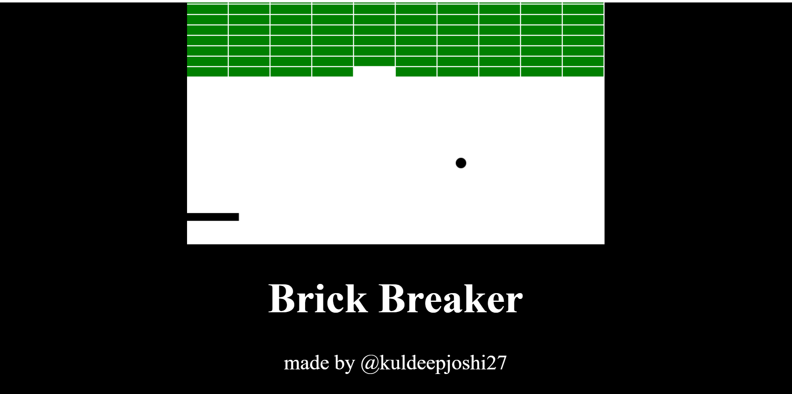

# Brick Breaker Game

It uses HTML, CSS, JavaScript.

<h2 align=center>Project Look:-</h2> 
 

## Getting Started

To use this application, simply open the `game.html` file in your web browser.

## Customization

If you want to customize the application, you can edit the any file to change the website.

## Contributing

If you would like to contribute to this project, please fork the repository and create a pull request with your changes.