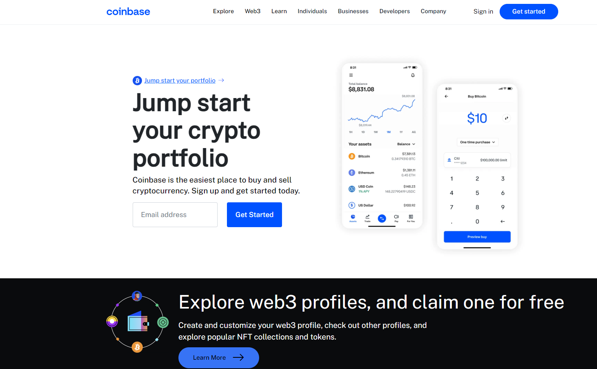

# Coinbase clone

A clone of the Coinbase landing page, showcasing the key features and services of the Coinbase platform.


## Preview



## Getting Started

These instructions will help you get a copy of the project up and running on your local machine.

### Prerequisites

- Web browser (e.g., Google Chrome, Mozilla Firefox)

### Installation

1. Clone the repository:

   ``` 
   $ git clone https://github.com/TusharKesarwani/Front-End-Projects.git
    ```
2. Open the index.html file in your web browser.

## Usage

- Explore the landing page to get an overview of Coinbase and its services.
- Click on the "Sign Up" or "Log In" buttons to access the Coinbase platform.
- Navigate through the different sections to learn more about Coinbase's features, security measures, and supported cryptocurrencies.
- Use the navigation menu to visit specific pages, such as "Pricing," "Earn," or "Learn."
- Interact with any interactive elements, such as buttons or forms, to experience the user interface.
## Contributing

Contributions are welcome! If you find any issues or have suggestions for improvements, please create a new issue.


## Acknowledgements

This project was created with the intention of replicating the design and user experience of the Coinbase landing page. We would like to acknowledge Coinbase for their original design and inspiration.

Note: This is a clone project and not affiliated with or endorsed by Coinbase.
