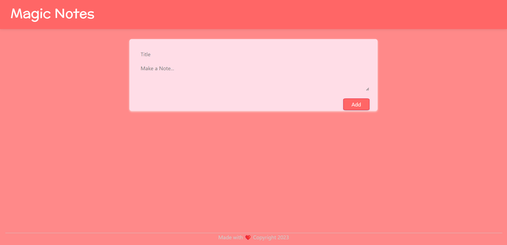

# MagicNotes
 #### This is a notes keeping app made using React js

 # Installation

1.Navigate to the Magic Notes folder.

    cd Magic Notes 
    
2.Now install the dependencies/Modules by running the below command  

    npm i 

3.Run the app in the development mode.

    npm start

##### Open http://localhost:3000 to view it in your browser.

# Screenshot

# THANK YOU 🙂