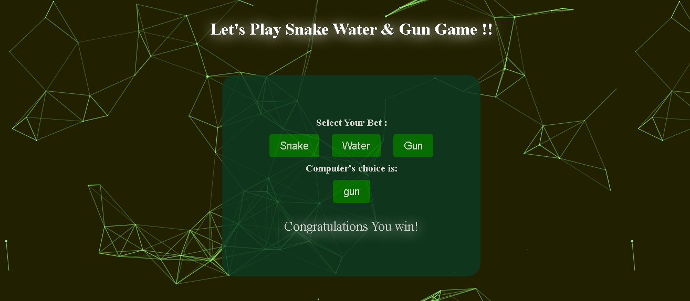

# **Snake, Water, Gun Game**
This is a simple game where the user plays against the computer by choosing between Snake, Water or Gun. The game consists of 3 rounds, and the player and computer scores are displayed at the end of each round.  

## How to Play
- Open the game in your browser.
- Click on the button corresponding to your choice: Snake, Water or Gun
- The computer will then make its choice, and the result of the round will be displayed. 

## Snapshot of the Game:

**Rules**
* Snake beats Gun
* Water beats Snake
* Gun beats Water

### How it works
The game uses JavaScript to determine the winner of each round. The computer's choice is randomly generated using the built-in Math.random() function. The game compares the player's choice with the computer's choice to determine the winner, and updates the scores accordingly.

Snapshot of Website

**Tech Stack Used :Html,Css and Vanilla Js**

## Conclusion
This game is a fun and simple way to test your luck and strategy against the computer. It can also be used as a tool to teach basic programming concepts such as conditionals and event listeners for the newbies.

