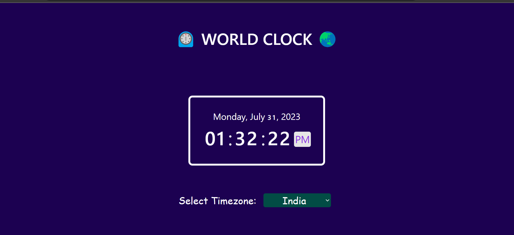
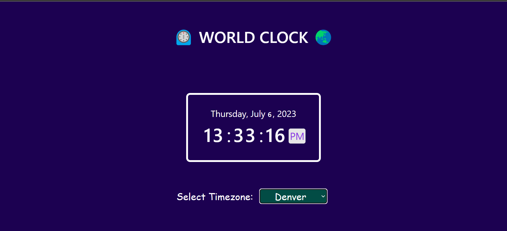
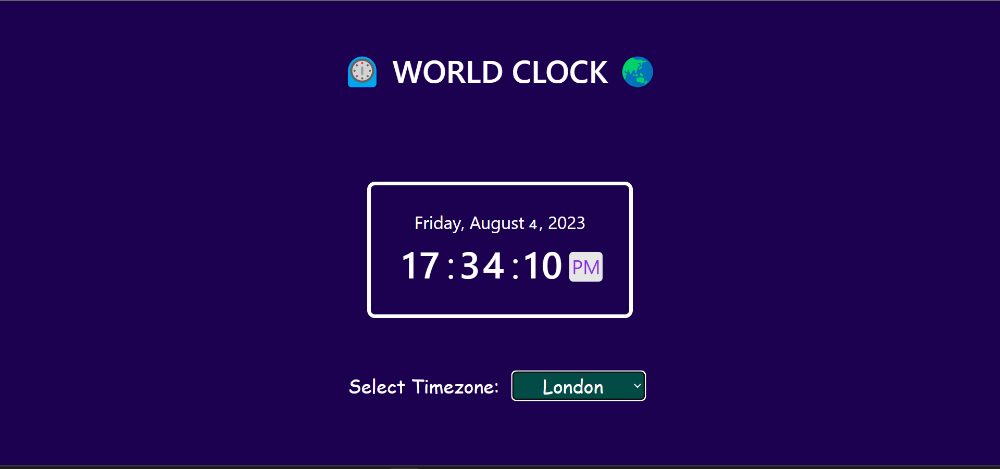
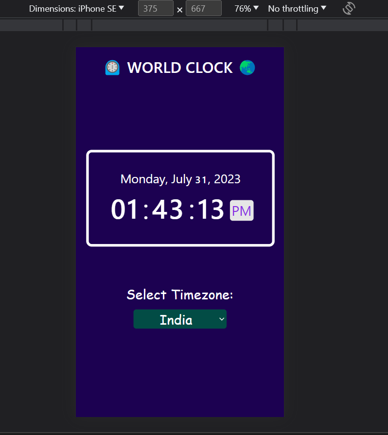

# ⏲️ WORLD CLOCK 🌏

# What is it?
As the name suggest this small program will help you get the realtime complete date and time of any timezone mentioned in the list.

## Tech Stack used
- HTML 
- CSS 
- Javascript, Jquery
- Basics of Bootstrap.

## Features
- Get the Complete Time of any timezone.
- Get the complete day, date, month and year of any timezone.

## Demo images of the project

---

---

---

---

## How to run it locally?
- Fork the repository.
- Clone the repository by using the command:-
---
    git clone [github url of the repository]

- go to the directory of the project using command:-
---
    cd [path of the project folder]
    
- Open the index.html file in any browser and see it running :)

### Thank you :)

