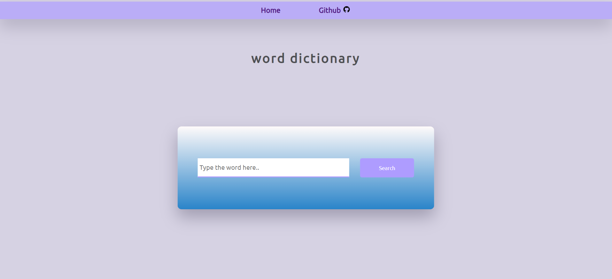
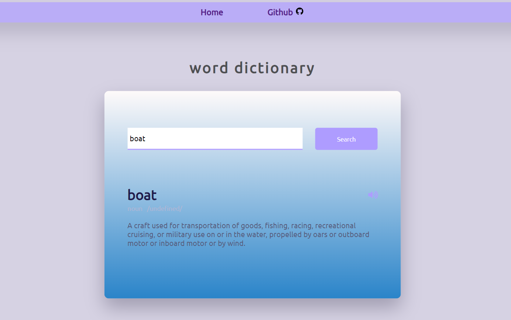

# Description
The dictionary app consists of a search text field and a search button. 
The user has to enter the word in the text field and click on the search button. The result displays the word meaning, word pronunciation along
with pronunciation audio clip. It also displays word usage for appropriate words. For words where example cannot be provided, the word usage space is hidden.

# Techstack
Purely based on Html, CSS and Javascript

# Screenshot

