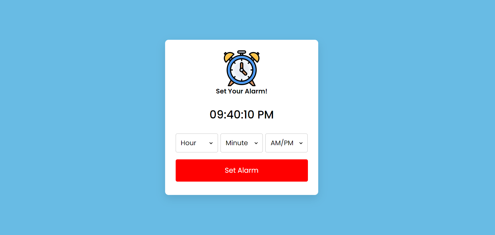

# Alarm setter Website
This website is used to remind ourselves of important tasks by setting an alarm.It can be used in day-to-day life.

## Technologies Used
 - HTML5 (structuring)  
 - CSS (styling)  
 - JavaScript (client side scripting)  
 - Git/GitHub (version control)  
 - Netlify (hosting)  

 ## Sample Output
 