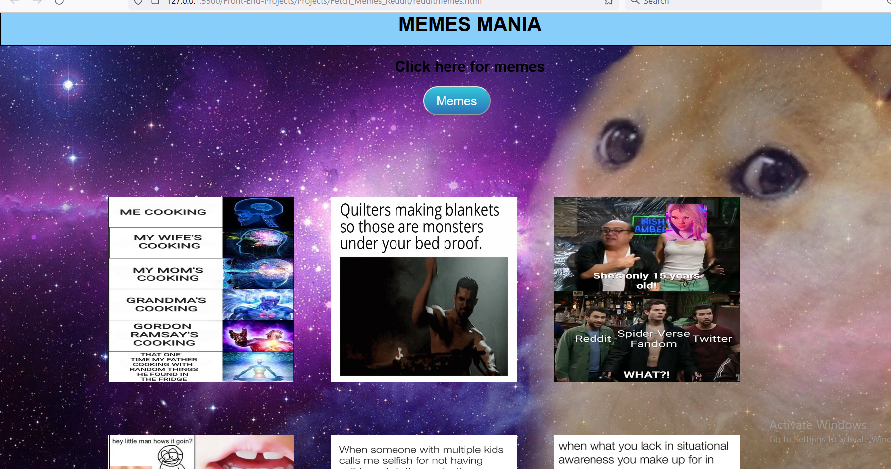

#   Fetch_Memes_Reddit
## 🛠️ Issue 837

# Description

This web fetching the memes from Reddit API in which I used HTML ,CSS , JAVASCRIPT And Reddit API. 

# Features
* Fetching Memes from Reddit API
* All memes shown at single dashboard
* On clicking Memes button then it fetch all Memes

# Technolgies Used
<li> HTML <BR>
<LI>CSS <BR>
<LI>JAVASCRIPT<BR>

# ScreenShot


## Getting Started

To run the Air-Quality application locally, follow these steps:

1. **Clone the repository**:

 ```bash
 git clone https://github.com/TusharKesarwani/Front-End-Projects.git
 ```

 2. **Navigate to the project directory**:

 ```bash
 cd Projects
 cd Fetch_Memes_Reddit
 ```
 3. Open the **index.html** file in your preferred web browser or in VS Code click on **Go Live** to open with live server.

