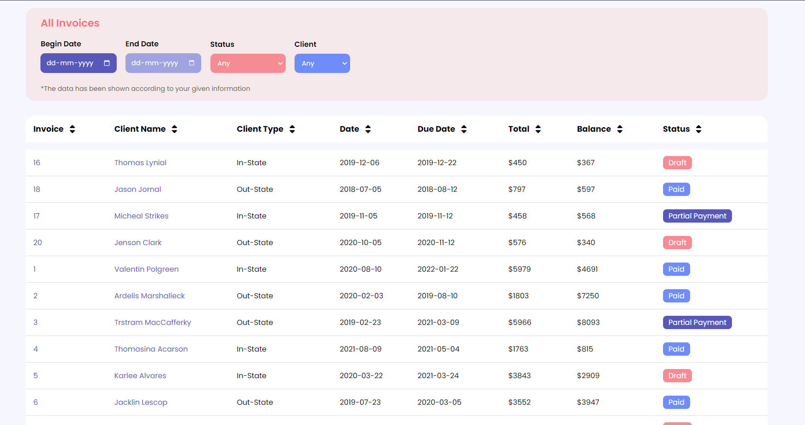
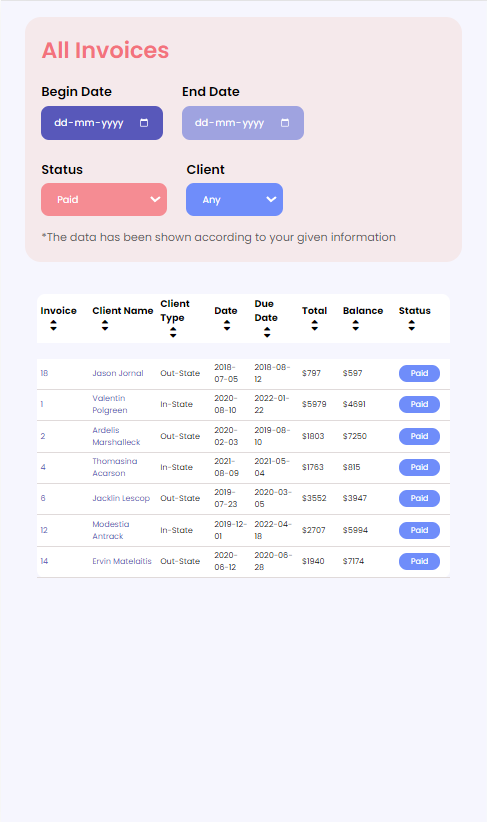

# Invoice-Filter-Program
This HTML, CSS, and JavaScript program allows users to filter and sort invoice data from a JSON file. The program includes functionality to filter invoices by begin date, due date, status, and in/out state, as well as sort the rows in ascending or descending order based on all columns. The JSON file serves as the data source for the program, providing the necessary information to populate the table and enable filtering and sorting. This program is ideal for users who need to manage a large number of invoices and require a reliable and efficient system for organizing and accessing this data.

# Tech Stack
- HTML
- CSS
- JAVASCRIPT
- JSON

# Design Approach 
* Getting Data from the file
-> The program is fetching all the invoice data from the JSON file named 'invoices.js' using fetch function and then passing it to a function to display the data on the invoice table in front-end.

* Filtering Approach
-> To filter the data, added a onchange event listener to all the fields in the filter section which basically call a function named as 'filter'.

* filter() function
-> The function first takes all the values of the fields in the filter section to filter out the data. To filter out the data it basically add a class named as 'hide'(which basically sets its display property to none) to the unnecessary rows to show only the required rows. 

* Why hiding rows?
-> Because, in this approach we only have to add/remove a class to the rows and we save alot of time in rewriting the whole data from scratch in the table.

* Sort Data According To Headers 
-> To sort the data, added a onclick event listener to all the header of the table, which basically calls a function named 'sortData'. 

* sortData() function
-> The function basically takes the data of the table from the DOM and store the data into an array. The array also contains an extra column which contains only two values(0/1) to denotes if the row is hidden by the filter or not. This function also has a parameter named 'sortby' which tells to sort the data by which header.

After that the function uses in-built 'sort' function of javascript to sort the data array, also pass function to it as a parameter to tells the function to how to sort the array and with which header.

To sort the data in ascending or descending, initialise an array with size equals to number of headers (to used as index for different headers). The element in this array contains only two values(0/1) to define in which order to sort. If the value is 0 then sort the data in ascending order and if 1 then sort the data in descending order.

Example: arr[2] = 0, this means sort the data according to 2 header in ascending order.

After sorting data the function passes the data into another function named 'displaySortedData' to display the data

* displaySortedData() function
-> The function takes sorted data(object/array) and iterate through the data and rewrite all the invoices data in the table in the DOM according to the sorted data.

* Other Functions:

* activeSortingOrder() 
-> This function takes two parameter 'col' which denotes the header and 'order' which denotes the ascending/descending icon.
This function highlight the asc/desc icon by adding a class named 'active'(which basically sets the color of the icon).

Example: activeSorrtingOrder(1, 1) which add a active class to the descending icon of the header 1(second header index started from 0).

* deactiveIcons()
-> This function basically selects all the icon which are contains 'active' class and remove 'active' class from them one by one. This function is called when the sortData function is called.

# Screenshots of the Project

# Contributed By :
Dinesh Kumar
