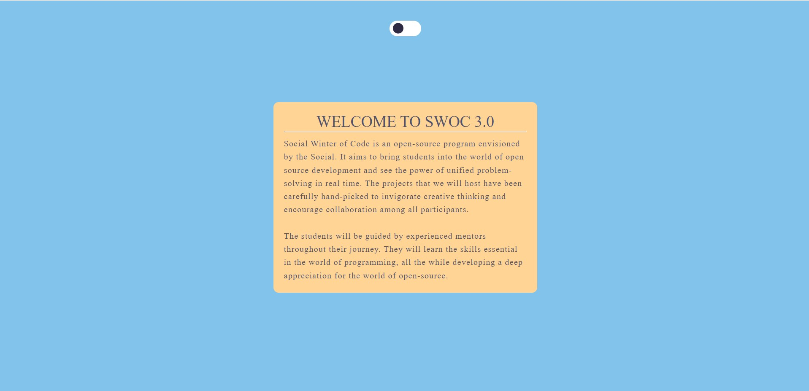

<h1>Theme-Switcher</h1>
<pre>created a Theme-Switcher with the help of HTML, CSS, JS. There are three file which are uploaded i.e
1)HTML
2)CSS
3)JavaScript.
which switch the theme light and dark modes
</pre>
<h2>TechStack</h2>
<pre>
The HyperText Markup Language or HTML is the standard markup language for documents designed to be displayed in a web browser.
It can be assisted by technologies such as Cascading Style Sheets (CSS) and scripting languages such as JavaScript.
</pre>
<h2>Screensot</h2>

