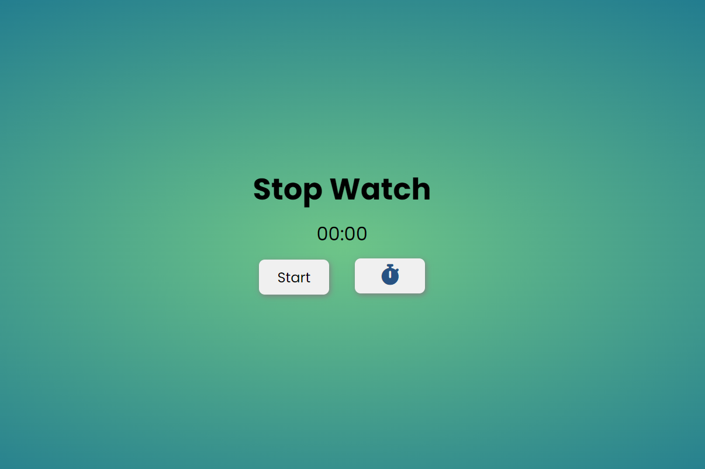

# Timer

A simple stopwatch timer implemented in HTML, CSS, and JavaScript.

## Description

This project provides a basic stopwatch timer with start, stop, and reset functionality. It displays the elapsed time in seconds and tenths of a second. The user can start and stop the timer using the "Start" button and reset the timer to zero using the "Reset" button.

## Preview



## Features

- Start and stop the timer.
- Reset the timer to zero.

## Getting Started

These instructions will help you get a copy of the project up and running on your local machine.

### Prerequisites

- Web browser (e.g., Google Chrome, Mozilla Firefox)

### Installation

1. Clone the repository:

   ```
       $ git clone https://github.com/TusharKesarwani/Front-End-Projects.git
    ```


2. Navigate to the project directory.

- Open the index.html file in your preferred web browser.

### Usage
1. Click the "Start" button to start the timer.
2. Click the "Stop" button to pause the timer.
3. Click the "Reset" button to reset the timer to zero.
